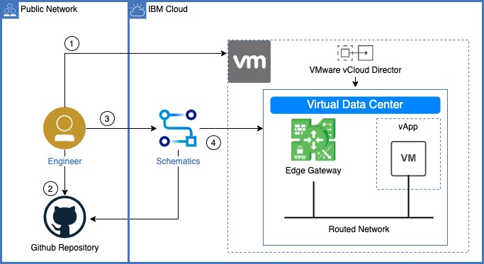

## Terraform Template for VMware Solutions Shared

Use this template to configure and provision virtual machines inside of an IBM Cloud for VMWare Solutions Shared environment.  This template is the repository used in the [Getting Started with IBM Cloud for VMWare Solutions Shared](https://cloud.ibm.com/docs/solution-tutorials?topic=solution-tutorials-vmware-solutions-shared-getting-started) tutorial.

1. Create a Schematics Workspace using the IBM Cloud console.
2. Create a VMWare Solutions Shared using the IBM Cloud console.
3. Review a Terraform template that will be used to create various resources in the virtual data center (VDC).
4. Use the Schematics service to run the template and to create the instance in the VDC.

# Costs

When you apply this template, you are charged for the resources that you configure.
